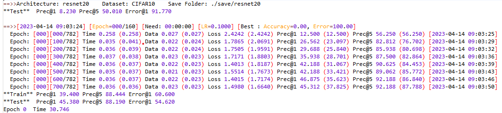
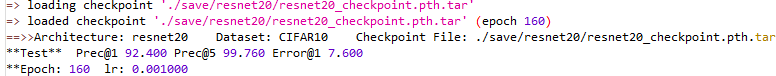

# 在CIFAR数据集上高效训练深度学习模型

&emsp;&emsp;目前，在 ImageNet 数据集上的预训练模型很多，而对于 CIFAR 数据集的预训练模型数量不多。CIFAR 常常被用作验证创新思想的数据集，虽然是一个小数据集，但不同的训练设置仍会导致显著不同的模型精度，训练出达到 baseline 精度的模型是一项必须且耗时的工作。

## 1. 前言
&emsp;&emsp;此前，我个人在需要 CIFAR 预训练模型时，总是将训练配置和模型结构用完即抛弃，导致在下一次需要训练新的模型架构时再重新设计结构、设置训练参数，浪费了很多时间。当然，CIFAR 训练设置可以很容易从 Github、Gitee 等平台获得，但很多代码没有考虑到扩展性，且对算力基本不做限制。**为了一劳永逸地解决 CIFAR 数据集模型训练问题，本文借鉴了多篇论文的模型训练代码，编写了基于 pytorch 的 CIFAR 数据集模型训练框架（在此我们简单的将该框架称为 *CMTF*）**。在代码编写过程中，我发现 CMTF 可能对低性能的 GPU 设备更友好。

&emsp;&emsp;CMTF 采用简单高效的训练配置，具有清晰的 log 风格，**支持 VGG（VGG11、13、16、19及其带Batchnormal版本）和 ResNET（ResNet20、32、44、56、110）架构的训练**。目前在CIFAR10上训练了 VGG16BN 和 ResNet20 模型上得到了checkpoint，**获得了不低于一些学术论文的baseline精度**。此外，CMTF 不需设置多卡并行计算，仅需简单操作即可添加新的模型结构和小型数据集， 易于扩展。

## 2. CMTF 安装运行
&emsp;&emsp;CMTF 已经被上传到 github，可按以下步骤将工程部署到本地计算平台。
+ 首先需要将工程下载到本地。
  + 对于 windows 用户，直接进入[进入网站](https://github.com/SunYaFeng1996/CifarModelTrainingFramework.git)下载工程，使用本地IDE打开工程即可；
  + 对于 linux 用户，可以使用 git 方法将工程下载至 linux 服务器：
> git clone SunYaFeng1996/CifarModelTrainingFramework.git

在服务器连不上外网的情况下也可直接进入[进入网站](https://github.com/SunYaFeng1996/CifarModelTrainingFramework.git)下载工程并上传到 linux 服务器。
+ 然后配置 python 环境。
 
如果用户想要使用一模一样的环境，可以使用 conda 新建环境：
``` linux
cd CMTF所在目录
conda env create -f environment.yaml
```
但CMTF 的 python 环境要求十分简单，**仅需要 pytorch 和 tensorboardX**，建议用户直接在现有环境中安装这两个包。
+ 最后运行程序训练模型。
  训练模型的核心文件位置为 ModelTrainingFramework /training /load_model.py ，用户应先进入工程目录：
  ```linux
  cd 本地路径/ModelTrainingFramework
  ```
  **请注意，用户只能进入 ModelTrainingFramework 文件夹运行上述命令**，若进入 training 文件夹运行则会因为 import 不成功而报错。接下来用户只需简单配置几个参数即可开始训练模型：
  ```linux
  python ./training/train_model.py \
    --arch=resnet20 \
    --dataset=CIFAR10 \
    --save_path=./save/resnet20/
  ```
  **参数 save_path 务必赋值规范**，不然checkpoint和日志文件所在文件夹的名字将不会与 arch 对应。

&emsp;&emsp;load_model.py 是主程序，可选的参数及范围见下表。
| 参数| 含义&emsp;&emsp;| 默认值 | 可选项/备注 |
|-|-|-|-|
| dataset | 数据集 | CIFAR10 | CIFAR10, CIFAR100 |
| data_path| 数据集路径| ./datasets/CIFAR10 | 绝对路径、相对路径均可|
| arch| 模型结构| resnet20| resnet20, resnet34, resnet56, resnet110, vgg11(13,16,19), vgg11(13,16,19)bn  |
| save_path| 检查点存储路径   | ./save/resnet20| 绝对路径、相对路径均可|
| manualSeed| 随机数种子| None   | 整数均可，不建议修改 |
| device  | 训练模型的计算平台 | cuda   | cuda, cpu  |
| print_freq| 每隔多少个批次输出 | 100 | 整数均可，不要超过批次数量，不建议修改 |
| test_bs | 测试集批次大小   | 256 | 整数均可，不建议修改 |
| train_bs| 训练集批次大小   | 64  | 整数均可，不建议修改 |
| test_workers  | 测试集进程数量   | 0   | 整数均可，不建议修改 |
| train_workers | 训练集进程数量   | 0   | 整数均可，不建议修改 |
| epochs  | 训练迭代时期| 160 | 不建议修改|
| start_epoch   | 从哪个时期开始   | 0   | 不建议修改|
| lr| 开始训练时的学习率 | 0.1 | 不建议修改|
| momentum| 动量  | 0.9 | 不建议修改|
| weight_decay  | 权重衰减| 1.00E-04| 不建议修改|

&emsp;&emsp;为了操作简单性，**建议用户只添加 arch、dataset、save_path 参数。** 上述运行完成后，检查点、运行 log 及训练曲线图将会 **保存在 save/resnet20** 文件夹。

## 3. CMTF 运行分析
&emsp;&emsp;以第2节中的运行参数为例，一开始 CMTF 的输出如下图所示。CMTF 会首先输出用户设定的模型结构、数据集和输出结果的存储路径。然后，进行一次模型验证，最后进入 epochs 迭代训练。

&emsp;&emsp;训练完成后，在 save/resnet20 文件夹下会生成 tb_log 文件夹以及 resnet20_best.pth.tar、resnet20_checkpoint.pth.tar、curve.png、log_training_resnet20_xxxx.txt。tb_log 是 tensorboardX 可用的文件夹， **resnet20_best.pth.tar、resnet20_checkpoint.pth.tar 分别是存储的训练完成后的检查点和训练过程中的最优检查点**，log_training_resnet20_xxxx.txt 记录了程序输出，curve.png 是训练曲线图，如下图所示。

&emsp;&emsp;训练曲线图表明训练性能大约在第80个 epoch 和第120个 epoch 大幅提升，这是由于学习率参数 lr 在这两个 epoch 时进行了缩减：
```python
if epoch in [args.epochs*0.5, args.epochs*0.75]:
            for param_group in optimizer.param_groups:
                param_group['lr'] *= 0.1
```
&emsp;&emsp;这也是 CMTF 仅有的 lr 调度策略，非常简单高效。在训练结束后，用户可以使用 training/load_model.py **加载检查点并验证**：
```linux
python ./training/load_model.py \
    --arch=resnet20 \
    --save_path=./save/resnet20 \
    --resume=./save/resnet20/resnet20_checkpoint.pth.tar
```
&emsp;&emsp;**同样地，用户也只能进入 ModelTrainingFramework 文件夹运行上述命令，而非 training 文件夹**。验证完成后会输出如下图所示。


&emsp;&emsp;首先会输出检查点是否加载成功，然后输出检查点的架构、数据集和存储路径，最后输出测试精度、Epoch 以及学习率。**如果用户的工作是对训练完成后的模型进行操作，建议直接在 load_model.py 内继续代码编写。**在 Tesla P40 GPU 上运行并验证，resnet20、vgg16、vgg16bn 的 top1 精度分别为 92.40%、93.63%、达到了很多学术论文的 baseline 精度，耗时大约一个半小时。
## 4. 扩展 CMTF
&emsp;&emsp;CMTF 的模型结构、模型操作和数据集代码在 all_utils 文件夹内。用户仅需简单操作即可添加新的数据集和模型结构。
+ 数据集。在 datasets_utils.py 内的 GetDataLoader() 函数添加，在 if 判断后加入 elif dataset == '新添加的数据集' 并在之后添加该数据集的处理代码。
+ 模型结构。在 models 文件夹内添加模型结构文件，并在 models_utils.py 内的 GetModel() 函数定义新模型创建方式。

&emsp;&emsp;仿照 models_utils.py 和 models_utils.py 内的代码，用户可以快速地在 CMTF 内加入自己的模型和数据集。

## 致谢&结束
&emsp;&emsp;CMTF 的 log代码及风格来自[Neural Network Weight Attack](https://github.com/elliothe/Neural_Network_Weight_Attack)，训练设置来自[rethinking network pruning](https://github.com/Eric-mingjie/rethinking-network-pruning)：
> Liu, Z., Sun, M., Zhou, T., Huang, G., & Darrell, T. (2018). Rethinking the value of network pruning. arXiv preprint arXiv:1810.05270.

> Rakin, A. S., He, Z., & Fan, D. (2019). Bit-flip attack: Crushing neural network with progressive bit search. In Proceedings of the IEEE/CVF International Conference on Computer Vision (pp. 1211-1220).

&emsp;&emsp;感谢他们的研究，强烈建议用户引用以上两个优秀的工作。

&emsp;&emsp;**CMTF 是我的第一个 github 项目。目前，我希望提升自己的博客撰写水平，如读者在实现过程中遇到困难，或在阅读本文时感到困惑，欢迎留言或添加我的QQ:1106295085。我将在周日下午回复，并积极修改本文。**
